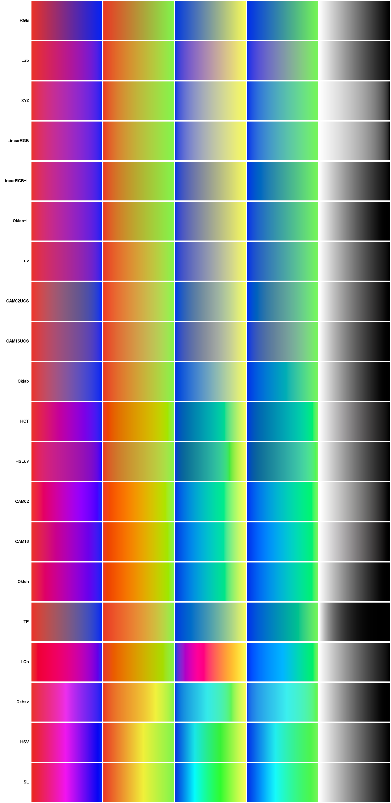
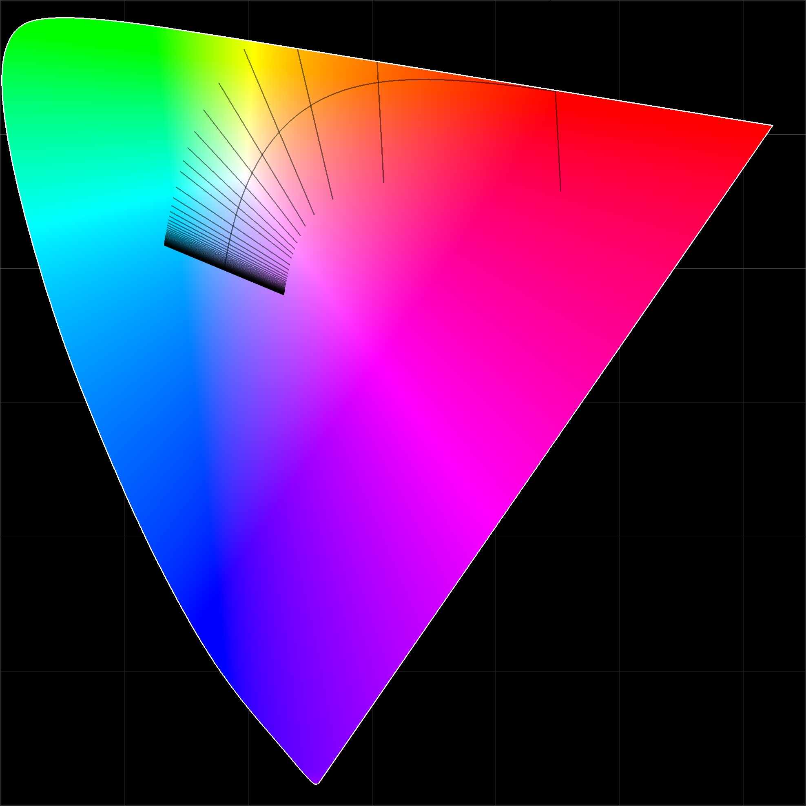

# Color

A comprehensive Java library for color science with 50+ color spaces, spectral calculations, and advanced color metrics.

## Key Features

- **Color spaces**: 50+ spaces, bidirectional conversions via unified `Color` interface
- **Color appearance models**: CAM16/CAM02 with uniform color spaces (UCS, LCD, SCD)
- **Spectral color**: Spectrum support, CRI, TM-30-20 color fidelity metrics
- **CCT calculations**: Improved Robertson, original Robertson, Ohno 2013
- **Standard observers**: CIE 1931, 1964, 2015, 2 and 10 degrees
- **Practical tools**: RGBW/RGBWW LED mixing, gamut management, WCAG compliance
- **Professional spaces**: ACES, ITP (HDR), HCT (Material You)
- **No dependencies**: Pure Java with floats

## Supported Color Spaces
Many color spaces are supported including RGB variants (HSV, HSL), CIE spaces (Lab, Luv, XYZ), modern perceptual spaces (Oklab, Oklch), color appearance models (CAM16, CAM02), video formats (YCbCr, YUV), professional spaces (ACES, ITP), and specialized spaces for computer vision and printing. See the full list at [com.esotericsoftware.color.space](src/com/esotericsoftware/color/space/).

All color spaces implement the `Color` interface, enabling conversion to any other space:

```java
RGB rgb = new RGB(1, 0.5f, 0.25f);
Lab lab = rgb.Lab();
CAM16 cam = lab.CAM16();
Oklab ok = cam.Oklab();
```

This library breaks from Java naming conventions to use capitalization that matches the color space names, making the code clearer and more aligned with color science literature. It also omits `from` or `to` prefixes to make for cleaner method names.

### Gradient Interpolation
This image shows color spaces suitable for gradient visualization. Generated by [Gradients.java](test/com/esotericsoftware/color/tools/Gradients.java).


## Color Appearance Models

### CAM16 and CAM02
Both models support customizable viewing conditions and have three uniform color space variants:

```java
// Standard uniform color space
CAM16UCS ucs = rgb.CAM16UCS();
CAM02UCS ucs2 = rgb.CAM02UCS();

// Large color differences (industry/design)
CAM16LCD lcd = rgb.CAM16LCD();
CAM02LCD lcd2 = rgb.CAM02LCD();

// Small color differences (quality control)
CAM16SCD scd = rgb.CAM16SCD();
CAM02SCD scd2 = rgb.CAM02SCD();

// Custom viewing conditions
CAM16.VC vc = CAM16.VC.with(
    Observer.CIE2.D65, // White point
    40,                // Adapting luminance (cd/m²)
    50,                // Background L* value
    2,                 // Surround (0=dark, 1=dim, 2=average)
    false              // Discounting illuminant
);
CAM16 cam = rgb.CAM16(vc);
```

## Color Temperature & Lighting

### Correlated Color Temperature (CCT)

Multiple methods are provided for CCT calculations:

```java
// Improved Robertson method (±0.1K accuracy)
CCT cct = rgb.CCT();                            // Default method
CCT cct = uv.CCT(CCT.Method.RobertsonImproved); // Explicit

// Original Robertson 1968 method (poor accuracy)
CCT cct = uv.CCT(CCT.Method.Robertson);

// Ohno 2013 method (moderate accuracy)
CCT cct = uv.CCT(CCT.Method.Ohno);

// Convert CCT to colors, 1000..100000K supported
RGB warmWhite = new CCT(2700).RGB();        // 2700K
RGB daylight = new CCT(6500, 0.003f).RGB(); // 6500K with Duv offset

// Exact Planck's law.
XYZ xyz = new CCT(5000).PlanckianXYZ();
```

### Improved Robertson Method

This library includes an improved Robertson method with high accuracy from [1000..100000K]:

|Method|Duv|K range|Max K error|@ K|Max Duv error|
|--|--|--|--|--|--|
|Robertson 1968|0|1,000..2,000|666.6666|1,000.0|0.0001|
|Robertson 1968|0|2,000..7,000|2.3999023|6,243.982|0.0001|
|Robertson 1968|0|7,000..20,000|46.351562|19,999.758|0.0001|
|Robertson 1968|0|20,000..60,000|377.125|50,376.125|0.0001|
|Robertson 1968|0|60,000..100,000|1959.1484|99,996.33|0.0001|
|Robertson 1968|-0.05..0.05|1,000..2,000|666.6666||0.0071|
|Robertson 1968|-0.05..0.05|2,000..7,000|4.38||0.007|
|Robertson 1968|-0.05..0.05|7,000..20,000|63.211||0.007|
|Robertson 1968|-0.05..0.05|20,000..60,000|551.493||0.007|
|Robertson 1968|-0.05..0.05|60,000..100,000|2586.657||0.007|
|Robertson improved|0|1,000..2,000|0.09698486|1,014.59644|0.0001|
|Robertson improved|0|2,000..7,000|0.10644531|5,353.7134|0.0001|
|Robertson improved|0|7,000..20,000|1.0742188|19,944.176|0.0001|
|Robertson improved|0|20,000..60,000|2.0195312|59,854.04|0.0001|
|Robertson improved|0|60,000..100,000|2.1953125|94,087.12|0.0001|
|Robertson improved|-0.05..0.05|1,000..2,000|0.132||0.0001|
|Robertson improved|-0.05..0.05|2,000..7,000|0.432||0.0001|
|Robertson improved|-0.05..0.05|7,000..20,000|1.471||0.0001|
|Robertson improved|-0.05..0.05|20,000..60,000|2.594||0.0001|
|Robertson improved|-0.05..0.05|60,000..100,000|4.165||0.0001|
|Ohno 2013|0|1,000..2,000|0.319458|1,993.7573|0.0001|
|Ohno 2013|0|2,000..7,000|1.0917969|6,999.519|0.0001|
|Ohno 2013|0|7,000..20,000|2.7089844|19,802.332|0.0001|
|Ohno 2013|0|20,000..60,000|3.6132812|47,194.17|0.0001|
|Ohno 2013|0|60,000..100,000|3.25|72,451.97|0.0001|
|Ohno 2013|-0.05..0.05|1,000..2,000|0.741||0.00064|
|Ohno 2013|-0.05..0.05|2,000..7,000|1.256||0.0001|
|Ohno 2013|-0.05..0.05|7,000..20,000|8.313||0.0001|
|Ohno 2013|-0.05..0.05|20,000..60,000|517||0.0003|
|Ohno 2013|-0.05..0.05|60,000..100,000|1492||0.5|

The [lookup table](https://github.com/EsotericSoftware/color/blob/main/src/com/esotericsoftware/color/space/CCT.java#L353) for that accuracy is generated by [CCTRobertsonLUT](https://github.com/EsotericSoftware/color/blob/main/test/com/esotericsoftware/color/tools/CCTRobertsonLUT.java) and contains only 131 entries: 5 floats each, 655 total. Instead of slope it stores direction, removing `sqrt` calls from the linear search. Binary and Fibonacci search were benchmarked but slower.

The Ohno table has 1545 floats, using 2.3x the memory for worse accuracy.

The bracketing for that accuracy results in this LUT spacing in u'v' space [1000..100000K+]:

The space before the last line is from 100000K to infinity K.

At ~1620K the Planckian locus slope changes from positive to negative, wrecking the line-side check that detects which 2 lines the point is between. The sign changes in the LUT at index 565, so the line-side check is reversed >= 565. Next problem interpolation between 560 (negative slope) and 565 (positive) is adjusted and Duv is flipped >= 565.

The [same code](https://github.com/EsotericSoftware/color/blob/main/src/com/esotericsoftware/color/space/uv.java#L29-L59) accepts either the improved Robertson LUT or the original (modified to store direction instead of slope) for u'v to CCT. The improved Robertson is also used for the [inverse conversion](https://github.com/EsotericSoftware/color/blob/main/src/com/esotericsoftware/color/space/CCT.java#L146-L179), from CCT to u'v'.

### RGB + White LEDs
Convert linear RGB or CCT to RGBW or RGBWW, using calibrated white LED colors.

```java
// RGBW (single white channel)
RGBW rgbw = linearRgb.RGBW(whitePoint);

// RGBWW (dual white channels)  
RGBWW rgbww = linearRgb.RGBWW(warmWhite, coolWhite);

// Create from color temperature (higher potential brightness)
CCT cct3000 = new CCT(3000);
RGBW rgbw = cct3000.RGBW(0.8f, whitePoint);
RGBWW rgbww = cct3000.RGBWW(0.8f, warmWhite, coolWhite);
```

## Spectral Color and Light Quality

### Spectrum Class
Work with spectral power distributions (380-780nm at 5nm intervals):

```java
// Create spectrum from color
Spectrum spectrum = rgb.spectrum();

// Get spectral values
float[] spd = spectrum.spectrum();
float at550nm = spectrum.get(550);

// Convert to color
XYZ xyz = spectrum.XYZ();
RGB rgb = spectrum.RGB();

// Spectral calculations
float luminousFlux = spectrum.luminousFlux();
float wavelength = spectrum.dominantWavelength();
```

### Color Rendering Index (CRI)
CIE 13.3-1995 color rendering index:

```java
// Calculate CRI for a light source
Spectrum lightSource = new CCT(3000).spectrum();
CRI cri = new CRI(lightSource);

float Ra = cri.Ra();  // General CRI (0-100)
float R9 = cri.Ri(9); // Red rendering (important for skin tones)

// All 14 test color samples
for (int i = 1; i <= 14; i++) {
    float Ri = cri.Ri(i);
}
```

### TM-30-20 Color Rendition
Modern color quality metrics:

```java
TM30 tm30 = new TM30(lightSource);

// Fidelity and gamut indices
float Rf = tm30.Rf(); // Fidelity (0-100)
float Rg = tm30.Rg(); // Gamut (typically 80-120)

// Detailed hue analysis (16 bins)
float[] Rfh = tm30.Rfh(); // Fidelity by hue
float[] Rgh = tm30.Rgh(); // Gamut by hue

// Design intent priorities
float preference = tm30.preference();
float fidelity = tm30.fidelity();
float vividness = tm30.vividness();
```

## Color Analysis & Utilities

### Color Difference
```java
// Delta E 2000: Perceptual lightness, chromaticity, and hue difference
float deltaE = rgb1.deltaE2000(rgb2);
float deltaE = lab1.deltaE2000(lab2);

// With custom weights for L*, C*, H*
float deltaE = lab1.deltaE2000(lab2, 2f, 1f, 1f);

// MacAdam steps: Perceptual chromaticity difference
float steps = xy1.MacAdamSteps(xy2);

// CAM16-UCS distance (perceptually uniform)
float distance = cam16ucs1.deltaE(cam16ucs2);
```

### Accessibility & Contrast
```java
// WCAG contrast ratio (1:1 to 21:1)
float ratio = foreground.contrastRatio(background);

// Check WCAG compliance
boolean meetsAA = foreground.WCAG_AA(background, largeText);
boolean meetsAAA = foreground.WCAG_AAA(background, largeText);
```

### Color Analysis
```java
// Convert to grayscale (perceptual luminance)
float gray = rgb.grayscale();

// Check if color is achromatic
boolean isGray = rgb.achromatic();

// Get relative luminance
float luminance = rgb.luminance();
```

### Color Harmonies
```java
RGB baseColor = new RGB(1, 0.5, 0.25);
RGB complementary = baseColor.complementary();
RGB[] triadic = baseColor.triadic();
RGB[] analogous = baseColor.analogous(30f); // 30° angle
RGB[] splitComp = baseColor.splitComplementary();
```

## Gamut Management

The `Gamut` class manages color space boundaries:

### Define Gamuts
```java
Gamut srgb = Gamut.sRGB;          // Standard RGB
Gamut p3 = Gamut.DisplayP3;       // Display P3
Gamut rec2020 = Gamut.Rec2020;    // Rec. 2020
Gamut full = Gamut.all;           // Full visible spectrum
Gamut hueA = Gamut.PhilipsHue.A;  // Philips Hue A
var triangular = new RGBGamut(red, green blue, Observer.CIE2.D65); // Custom
var polygonal = new PolygonGamut( // Custom
	new xy(0.68f, 0.32f),  // Red-ish
	new xy(0.265f, 0.69f), // Green-ish
	new xy(0.15f, 0.06f),  // Blue-ish
	new xy(0.50f, 0.40f)   // Yellow-ish
);
```

### Gamut Operations
```java
boolean inGamut = gamut.contains(chromaticity);

// Closest point if outside gamut
xy clamped = gamut.clamp(chromaticity);
```

## Utility Functions

Many color spaces support component operations, scaling, interpolation, and distance calculations:

```java
// Component operations
float L = lab.get(0);                // Get by index
Lab darker = lab.add(-10, 0, 0);     // Add to components
RGB scaled = rgb.scl(0.5f);          // Scale all components
float distance = color1.dst(color2); // Euclidean distance

// Interpolation in any space
Oklab mixed = oklab1.lerp(oklab2, 0.5f); // 50% blend

// Utility functions
import static com.esotericsoftware.color.Util.*;

float encoded = sRGB(linear);   // Gamma correction
String hex = hex(rgb);          // "FF8040"
float[] values = floats(color); // Convert to array
int dmx = dmx16(0.5f);          // DMX lighting control
```

## Spectral Locus

Utilities are provided for working with spectral colors and the visible spectrum boundary.



### Wavelength to Chromaticity
```java
// Convert wavelength (380-700nm) to CIE u'v' coordinates
uv color550nm = SpectralLocus.uv(550);   // Green at 550nm
xy color550nmXY = SpectralLocus.xy(550); // Same in xy space

// Get exact spectral colors
uv red = SpectralLocus.uv(700);   // Deep red
uv blue = SpectralLocus.uv(450);  // Blue
uv green = SpectralLocus.uv(550); // Green
```

### Spectrum Boundary Testing
```java
// Check if a color is within the visible spectrum
uv testColor = rgb.uv();
boolean visible = SpectralLocus.contains(testColor);

// Colors outside the spectral locus are not physically realizable
boolean impossible = SpectralLocus.contains(new uv(0.8f, 0.8f)); // false
```

### Dominant Wavelength
```java
// Find the dominant wavelength of any color
uv color = new RGB(0, 1, 0).uv(); // Green RGB
float wavelength = SpectralLocus.dominantWavelength(color); // ~550nm

// Purple/magenta colors return negative complementary wavelengths
uv magenta = new RGB(1, 0, 1).uv();
float purpleWave = SpectralLocus.dominantWavelength(magenta); // Negative value

// Use custom white point
float wavelength2 = SpectralLocus.dominantWavelength(color, Observer.CIE2.A);
```

### Excitation Purity
```java
// Measure color saturation (0 = white, 1 = pure spectral color)
float purity = SpectralLocus.excitationPurity(color);

// Gray has low purity
uv gray = new RGB(0.5f, 0.5f, 0.5f).uv();
float grayPurity = SpectralLocus.excitationPurity(gray); // < 0.1

// Saturated colors have high purity
uv saturated = new RGB(1, 0, 0).uv();
float redPurity = SpectralLocus.excitationPurity(saturated); // > 0.8
```

## Standard Observers

CIE standard observers are provided:

```java
// 2 degree observer
XYZ d65_2deg = Observer.CIE2_1931.D65;
XYZ d50_2deg = Observer.CIE2_1931.D50;

// 10 degree observer
XYZ d65_10deg = Observer.CIE10_1964.D65;

// 2015
XYZ d65_2deg_2015 = Observer.CIE2_2015.D65;
```

Available Observers: A, C, D50, D55, D65, D75, F2, F7, F11

## Chromatic Adaptation Transforms

```java
// Various CAT methods for cone response
LMS lms = xyz.LMS(LMS.CAT.Bradford);
LMS lms = xyz.LMS(LMS.CAT.vonKries);
LMS lms = xyz.LMS(LMS.CAT.CAT02);
LMS lms = xyz.LMS(LMS.CAT.CAT97);
LMS lms = xyz.LMS(LMS.CAT.HPE);

// Convert back
XYZ xyz = lms.XYZ(LMS.CAT.Bradford);
```

## Quick Examples

```java
import com.esotericsoftware.color.space.*;

// Basic conversions
RGB rgb = new RGB(0.5f, 0.7f, 0.3f);
HSV hsv = rgb.HSV();
Lab lab = rgb.Lab();
CAM16 cam = lab.CAM16();

// Perceptual color mixing
Oklab color1 = rgb1.Oklab();
Oklab color2 = rgb2.Oklab();
Oklab mixed = color1.lerp(color2, 0.5f); // 50% blend

// Color temperature
RGB warmWhite = new CCT(2700).RGB();       // 2700K
RGB daylight = new CCT(6500).RGB(-0.003f); // 6500K with Duv

// Accessibility
boolean meetsWCAG = foreground.WCAG_AA(background, false);
float contrast = foreground.contrastRatio(background);
```

## License

This library is released under the [BSD 3-Clause License](LICENSE).
