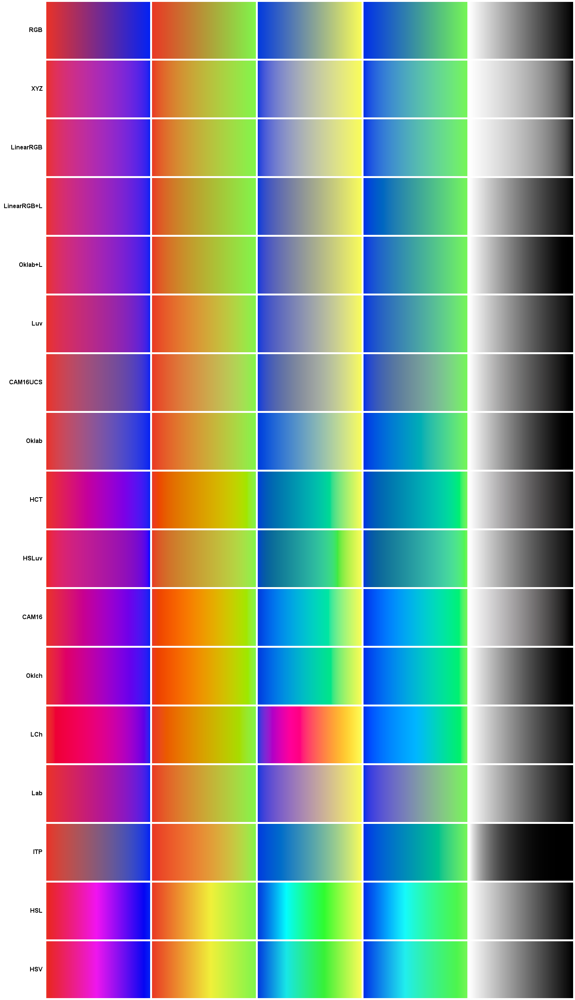
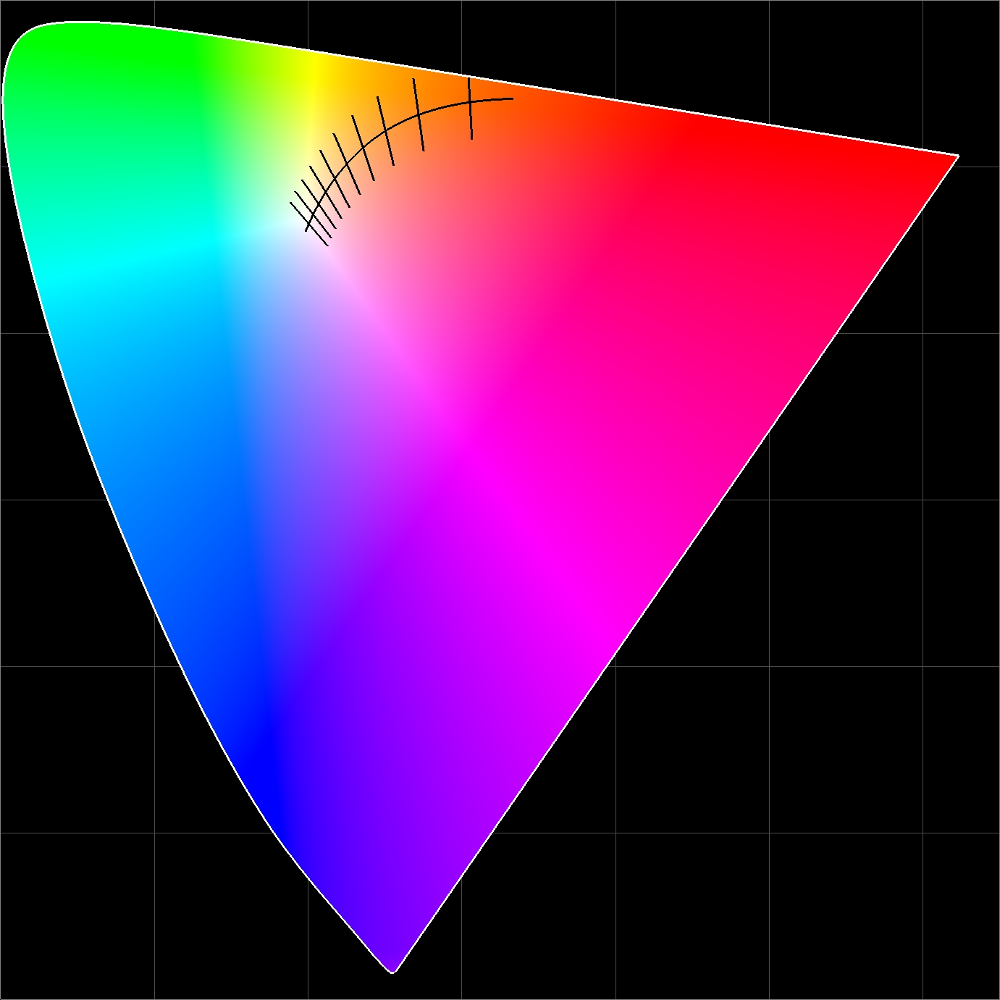

# Colors

This Java library provides color space conversions and other color related utilities.

- **Color space conversions** 40+, bidirectional
- **Spectral locus** wavelength conversion, dominant wavelength, purity
- **Gamut management** for multiple display standards
- **RGBW/RGBWW mixing** for LED systems
- **Color difference** Delta E 2000, MacAdam steps, WCAG contrast
- **Color utilities** CCT/Duv, gamma, harmony, formatting, lerp
- **Industry standard color spaces** video, broadcasting, printing
- **Extensive tests** 110+

The code uses floats and is straightforward, without dependencies, making it easy to port if needed.

## Color Space Conversions

### RGB-Based Color Spaces

#### Standard Color Models
- RGB
- Linear RGB
- HSV (Hue, Saturation, Value)
- HSL (Hue, Saturation, Lightness)  
- HSI (Hue, Saturation, Intensity)
- IHS (Intensity, Hue, Saturation)

#### CIE Color Spaces
- Lab (CIELAB)
- Luv (CIELUV)
- LCh - Lab-based cylindrical
- LCHuv - Luv-based cylindrical
- uv (CIE 1960 UCS)
- u'v' (CIE 1976 UCS)
- XYZ (CIE 1931 XYZ)
- xy (CIE 1931 chromaticity)
- xyY (CIE 1931 xyY)

#### Perceptually Uniform Spaces
- Oklab - Modern perceptually uniform color space
- Oklch - Cylindrical version of Oklab
- Okhsv - Oklab-based HSV
- Okhsl - Oklab-based HSL
- HSLuv - Human-friendly perceptual HSL

#### Video & Broadcasting
- YCbCr - Digital video, supports ITU BT.601 and BT.709
- YUV - PAL television
- YIQ - NTSC television
- YCoCg - Lossless color transform
- YCC - Kodak Photo YCC
- YES - Xerox YES television

#### Printing & Other Spaces
- CMYK (Cyan, Magenta, Yellow, Key/Black) - Subtractive colors for printing
- LMS (Long, Medium, Short) - Human cone response
- TSL (Tint, Saturation, Lightness) - Face detection
- rg - Normalized chromaticity
- Hunter Lab - Precursor to CIELAB
- C1C2C3 (3 opponent color channels) - Image processing
- O1O2 (2 opponent color channels) - Image processing

#### Advanced Color Spaces
- CAM16 - Color appearance model with viewing conditions
- CAM16UCS - Uniform color space based on CAM16
- HCT (Hue, Chroma, Tone) - Google Material You
- ACES2065-1 - Academy Color Encoding System, AP0 primaries
- ACEScg - Working space for CGI, AP1 primaries
- ACEScc - Logarithmic for color grading, AP1 primaries
- ITP (ICtCp/ITU-R BT.2100) - HDR and wide color gamut

### Gradient Interpolation
This image shows a few gradients for some of the supported color spaces. Other color spaces aren't suitable for gradient visualization. It was generated by [Gradients.java](test/com/esotericsoftware/colors/Gradients.java).



### Example Usage
It is convenient to omit `Colors.` using a static import:
```java
import static com.esotericsoftware.Colors.*;
```

Records are provided for type safety and method signature clarity rather than using `float[]`. Any record can be converted using `float[] values = array(record)`.

This library breaks from Java naming conventions to use capitalization that matches the color space names, making the code clearer and more aligned with color science literature.

#### Standard Color Models
- **HSV** (Hue, Saturation, Value)
  ```java
  HSV hsv = HSV(rgb);
  RGB rgb = RGB(hsv);
  ```

- **HSL** (Hue, Saturation, Lightness)
  ```java
  HSL hsl = HSL(rgb);
  RGB rgb = RGB(hsl);
  ```

- **HSI** (Hue, Saturation, Intensity)
  ```java
  HSI hsi = HSI(rgb);
  RGB rgb = RGB(hsi);
  ```

#### CIE Color Spaces
- **Lab** (CIELAB)
  ```java
  Lab lab = Lab(rgb);
  RGB rgb = RGB(lab);
  // With white point:
  Lab lab = Lab(rgb, Illuminant.CIE2.D50);
  Lab lab = Lab(rgb, customWhitePoint);
  ```

- **Luv** (CIELUV)
  ```java
  Luv luv = Luv(rgb);
  RGB rgb = RGB(luv);
  ```

- **LCh** (Lab-based cylindrical)
  ```java
  LCh lch = LCh(rgb);
  RGB rgb = RGB(lch);
  ```

- **XYZ** (CIE 1931 XYZ)
  ```java
  XYZ xyz = XYZ(rgb);
  RGB rgb = RGB(xyz);
  ```

#### Perceptually Uniform Spaces
- **Oklab** - Modern perceptually uniform color space
  ```java
  Oklab oklab = Oklab(rgb);
  RGB rgb = RGB(oklab);
  ```

- **Oklch** - Cylindrical version of Oklab
  ```java
  Oklch oklch = Oklch(rgb);
  RGB rgb = RGB(oklch);
  ```

- **Okhsv/Okhsl** - Oklab-based HSV/HSL alternatives
  ```java
  Okhsv okhsv = Okhsv(rgb);
  Okhsl okhsl = Okhsl(rgb);
  ```

#### Video & Broadcasting

#### Printing & Other Spaces
- **CMYK** - Cyan, Magenta, Yellow, Key (Black)
  ```java
  CMYK cmyk = CMYK(rgb);
  RGB rgb = RGB(cmyk);
  ```

- **LMS** - Cone Response Space
  ```java
  LMS lms = LMS(xyz, CAT.Bradford);
  XYZ xyz = XYZ(lms, CAT.Bradford);
  ```

- **O1O2** - Opponent Color Space (Forward only)
  ```java
  O1O2 o1o2 = O1O2(rgb);
  // O1: Yellow-blue opponent [-1..1]
  // O2: Red-green opponent [-0.5..0.5]
  ```

- **C1C2C3** - 3-Channel Opponent Space (Forward only)
  ```java
  C1C2C3 c1c2c3 = C1C2C3(rgb);
  // C1, C2, C3: Achromatic channels [0..pi/2]
  ```

### Chromaticity Coordinates
- **xy** (CIE 1931), **uv** (CIE 1976), **uv1960** (CIE 1960)
  ```java
  xy chromaticity = xy(rgb, gamut);
  uv1960 uv60 = uv1960(chromaticity);
  RGB rgb = RGB(chromaticity);  // Uses sRGB gamut
  RGB rgb = RGB(chromaticity, gamut);
  uv uv76 = uv(rgb);
  XYZ xyz = XYZ(chromaticity, 50);  // Y=50
  ```

## Color Temperature & Lighting

### Correlated Color Temperature (CCT)
```java
// Create RGB from color temperature
RGB warmWhite = RGB(2700, 0);   // 2700K, Duv=0
RGB daylight = RGB(6500, 0.003f);  // 6500K, Duv=0.003

// Calculate CCT from color
float temperature = CCT(rgb);

// Duv - Distance from Planckian locus
float duv = Duv(rgb);
```

### RGB + White LEDs
```java
// RGBW (single white channel)
RGBW rgbw = RGBW(rgb, whitePoint);

// RGBWW (dual white channels)
RGBWW rgbww = RGBWW(rgb, warmWhite, coolWhite);

// Create from color temperature (higher potential brightness)
RGBW rgbw = RGBW(3000, 0.8f, whitePoint);  // 3000K at 80% brightness
RGBWW rgbw = RGBWW(3000, 0.8f, warmWhite, coolWhite);
```

## Color Analysis & Utilities

### Color Difference
```java
// Delta E 2000 - Perceptual lightness, chromaticity, and hue difference
float deltaE = deltaE2000(rgb1, rgb2);
float deltaE = deltaE2000(lab1, lab2);

// With custom weights for L*, C*, H*
float deltaE = deltaE2000(lab1, lab2, 2f, 1f, 1f);

// MacAdam steps - Perceptual chromaticity difference
float steps = MacAdamSteps(xy1, xy2);
```

### Accessibility & Contrast
```java
import static com.esotericsoftware.colors.Util.RGBUtil.*;

// WCAG contrast ratio (1:1 to 21:1)
float ratio = contrastRatio(foreground, background);

// Check WCAG compliance
boolean meetsAA = WCAG_AA(fg, bg, largeText);
boolean meetsAAA = WCAG_AAA(fg, bg, largeText);
```

### Color Analysis
```java
// Convert to grayscale (perceptual luminance)
float gray = grayscale(rgb);

// Check if color is achromatic
boolean isGray = achromatic(rgb);

// Get Y (luminance) from L* (perceptual lightness)
float Y = LabUtil.LstarToY(50);  // L*=50 -> Y=~18.4
float Yn = LabUtil.LstarToYn(50);  // Normalized [0,1]

// Get L* from Y
float Lstar = LabUtil.YtoLstar(18.4);
```

### Color Harmonies
```java
import static com.esotericsoftware.colors.Util.RGBUtil.*;
RGB complementary = complementary(baseColor);
RGB[] triadic = triadic(baseColor);
RGB[] analogous = analogous(baseColor, 30f);  // 30° angle
RGB[] splitComp = splitComplementary(baseColor);
```

#### Video & Broadcasting Examples
- **YCbCr** - Digital video color space
  ```java
  YCbCr ycbcr = YCbCr(rgb, YCbCrColorSpace.ITU_BT_709_HDTV);
  RGB rgb = RGB(ycbcr, YCbCrColorSpace.ITU_BT_709_HDTV);
  ```

- **YUV/YIQ/YCoCg** - Television and lossless formats
  ```java
  YUV yuv = YUV(rgb);      // PAL television
  YIQ yiq = YIQ(rgb);      // NTSC television
  YCoCg ycocg = YCoCg(rgb); // Lossless transform
  YCC ycc = YCC(rgb);      // Kodak Photo YCC
  YES yes = YES(rgb);      // Xerox YES
  ```

#### Advanced Color Spaces

- **TSL** (Tint, Saturation, Lightness) - Face Detection
  ```java
  TSL tsl = TSL(rgb);
  RGB rgb = RGB(tsl);
  // Optimized for skin tone analysis in computer vision
  // Note: When T=0, the inverse uses "negative zero" to distinguish between 
  // two possible solutions, as the reverse mapping is not unique
  ```

- **ITP** (ICtCp/HDR Color Space)
  ```java
  ITP itp = ITP(rgb);
  RGB rgb = RGB(itp);
  // Supports HDR content and wide color gamut (ITU-R BT.2100)
  // Full round-trip accuracy BT.2020 conversion
  ```

- **HCT** (Hue, Chroma, Tone) - Google Material You
  ```java
  HCT hct = HCT(rgb);
  RGB rgb = RGB(hct);
  // Perceptually accurate color system used in Material Design
  ```

- **CAM16** (Color Appearance Model)
  ```java
  // Using default viewing conditions
  CAM16 cam = CAM16(rgb);
  
  // With custom viewing conditions
  CAM16.VC vc = CAM16.VC.create(
    Illuminant.CIE2.D50,  // White point
    40,                   // Adapting luminance (cd/m²)
    50,                   // Background L* value
    2,                    // Surround (0=dark, 1=dim, 2=average)
    false                 // Discounting illuminant
  );
  CAM16 cam = CAM16(rgb, vc);
  
  // Convert to/from uniform color space
  CAM16UCS ucs = CAM16UCS(cam, vc);
  CAM16 cam2 = CAM16(ucs, vc);
  ```

- **ACES** (Academy Color Encoding System)
  ```java
  // ACES2065-1 (archival format, AP0 primaries)
  ACES2065_1 aces2065 = ACES2065_1(rgb);
  RGB rgb = RGB(aces2065);
  
  // ACEScg (CGI working space, AP1 primaries)
  ACEScg acesCg = ACEScg(rgb);
  RGB rgb = RGB(acesCg);
  
  // ACEScc (logarithmic color grading, AP1 primaries)
  ACEScc acesCc = ACEScc(rgb);
  RGB rgb = RGB(acesCc);
  ```

## Gamut Management

The `Gamut` class manages color space boundaries:

### Predefined Gamuts
```java
Gamut srgb = Gamut.sRGB;          // Standard RGB
Gamut p3 = Gamut.DisplayP3;       // Display P3
Gamut rec2020 = Gamut.Rec2020;    // Rec. 2020
Gamut full = Gamut.all;           // Full visible spectrum
Gamut huaA = Gamut.PhilipsHue.A;  // Philips Hue A
var custom = new Gamut(red, green blue);
```

### Gamut Operations
```java
boolean inGamut = gamut.contains(chromaticity);

// Closest point if outside gamut
xy clamped = gamut.clamp(chromaticity);
```

## Utility Functions

### Gamma Correction
- `sRGB(float linear)` - sRGB gamma encoding
- `linear(float srgb)` - sRGB gamma decoding
- `gammaEncode(float linear, float gamma)` - Custom gamma encoding
- `gammaDecode(float encoded, float gamma)` - Custom gamma decoding

```java
// sRGB gamma encoding/decoding
float encoded = sRGB(linearValue);
float linear = linear(sRGBValue);

// Custom gamma
float encoded = gammaEncode(linear, 2.2f);
float decoded = gammaDecode(encoded, 2.2f);
```

### Float arrays
- `floats(Record record)` - Convert color record to float array

```java
// Convert any color record to float array
float[] rgbArray = floats(rgb);  // [r, g, b]
float[] hsvArray = floats(hsv);  // [H, S, V]
float[] labArray = floats(lab);  // [L, a, b]
```

### Output Formatting
- `hex(Record)` or `hex(float... values)` - Convert to hex color string
- `toString(Record)` or `toString(float... values)` - Convert to string (float values)
- `toString255(Record)` or `toString255(float... values)` - Convert to string (0-255 values)
- `dmx8(float value)` - Convert to 8-bit DMX value (0-255)
- `dmx16(float value)` - Convert to 16-bit DMX value (0-65535)

```java
// Hex color string
String hex1 = hex(new RGB(r, g, b));  // "7F7F7F"
String hex2 = hex(r, g, b);           // "7F7F7F"

// RGB string (float values)
String str1 = toString(new RGB(r, g, b));  // "0.5, 0.5, 0.5"
String str2 = toString(r, g, b);           // "0.5, 0.5, 0.5"

// RGB string (0-255 values)
String str1 = toString255(new RGB(r, g, b));  // "128, 128, 128"
String str2 = toString255(r, g, b);           // "128, 128, 128"

// DMX control
int dmx8bit = dmx8(0.5f);    // 128
int dmx16bit = dmx16(0.5f);  // 32767
```

## Spectral Locus

Utilities are provided for working with spectral colors and the visible spectrum boundary.



### Wavelength to Chromaticity
```java
// Convert wavelength (380-700nm) to CIE u'v' coordinates
uv color550nm = SpectralLocus.uv(550);  // Green at 550nm
xy color550nmXY = SpectralLocus.xy(550);  // Same in xy space

// Get exact spectral colors
uv red = SpectralLocus.uv(700);    // Deep red
uv blue = SpectralLocus.uv(450);   // Blue
uv green = SpectralLocus.uv(550);  // Green
```

### Spectrum Boundary Testing
```java
// Check if a color is within the visible spectrum
uv testColor = uv(rgb);
boolean visible = SpectralLocus.contains(testColor);

// Colors outside the spectral locus are not physically realizable
boolean impossible = SpectralLocus.contains(new uv(0.8f, 0.8f)); // false
```

### Dominant Wavelength
```java
// Find the dominant wavelength of any color
uv color = uv(new RGB(0, 1, 0));  // Green RGB
float wavelength = SpectralLocus.dominantWavelength(color);  // ~550nm

// Purple/magenta colors return negative complementary wavelengths
uv magenta = uv(new RGB(1, 0, 1));
float purpleWave = SpectralLocus.dominantWavelength(magenta);  // Negative value

// Use custom white point
float wavelength2 = SpectralLocus.dominantWavelength(color, Illuminant.CIE2.A);
```

### Excitation Purity
```java
// Measure color saturation (0 = white, 1 = pure spectral color)
float purity = SpectralLocus.excitationPurity(color);

// Gray has low purity
uv gray = uv(new RGB(0.5f, 0.5f, 0.5f));
float grayPurity = SpectralLocus.excitationPurity(gray);  // < 0.1

// Saturated colors have high purity
uv saturated = uv(new RGB(1, 0, 0));
float redPurity = SpectralLocus.excitationPurity(saturated);  // > 0.8
```

## Standard Illuminants

CIE standard illuminants are included for both 2° and 10° observers:

```java
// 2° observer
XYZ d65_2deg = CIE2.D65;
XYZ d50_2deg = CIE2.D50;

// 10° observer
XYZ d65_10deg = CIE10.D65;
```

Available illuminants: A, C, D50, D55, D65, D75, F2, F7, F11

## Chromatic Adaptation Transforms

```java
// Various CAT methods for cone response
LMS lms = LMS(xyz, CAT.Bradford);
LMS lms = LMS(xyz, CAT.vonKries);
LMS lms = LMS(xyz, CAT.CAT02);
LMS lms = LMS(xyz, CAT.CAT97);
LMS lms = LMS(xyz, CAT.HPE);

// Convert back
XYZ xyz = XYZ(lms, CAT.Bradford);
```

## Usage Examples

### Basic Color Conversion
```java
// Convert RGB to HSV
RGB rgb = new RGB(0.5f, 0.7f, 0.3f);
HSV hsv = HSV(rgb);
System.out.println("Hue: " + hsv.h + "°");
// Convert back to RGB
RGB rgb2 = RGB(hsv);
```

### Perceptual Colors
```java
// Use Oklab for perceptually uniform operations
Oklab color1 = Oklab(rgb1);
Oklab color2 = Oklab(rgb2);
// Interpolate in perceptual space
Oklab middle = lerp(color1, color2, 0.5f);
RGB result = RGB(middle);
```

### Color Interpolation
```java
RGB red = new RGB(1, 0, 0);
RGB blue = new RGB(0, 0, 1);

// RGB interpolation (simple but not perceptual)
RGB rgbMix = lerp(red, blue, 0.5f);  // Purple

// Lab interpolation (perceptually uniform)
Lab labMix = lerp(Lab(red), Lab(blue), 0.5f);
RGB labResult = RGB(labMix);  // More perceptual purple

// HSL interpolation (hue-based, handles angles correctly)
HSL hslMix = lerp(HSL(red), HSL(blue), 0.5f);
RGB hslResult = RGB(hslMix);  // Goes through magenta

// Oklab interpolation (modern perceptual)
Oklab oklabMix = lerp(Oklab(red), Oklab(blue), 0.5f);
RGB oklabResult = RGB(oklabMix);  // Best perceptual result

// Create smooth gradients
for (float t = 0; t <= 1; t += 0.1f) {
	RGB color = RGB(lerp(Oklab(red), Oklab(blue), t));
	// Use color for gradient.
}
```

### Color Temperature to RGB
```java
// Create warm white (2700K)
RGB warmWhite = RGB(2700, 0f);
// Create daylight (6500K) with slight green tint
RGB daylight = RGB(6500, -0.003f);
```

### Accessibility Checking
```java
RGB background = new RGB(1, 1, 1);  // White
RGB text = new RGB(0.2f, 0.2f, 0.2f);
float contrast = contrastRatio(text, background);
boolean accessible = WCAG_AA(text, background, false);
if (!accessible) System.out.println("Text color fails WCAG AA standards");
```
